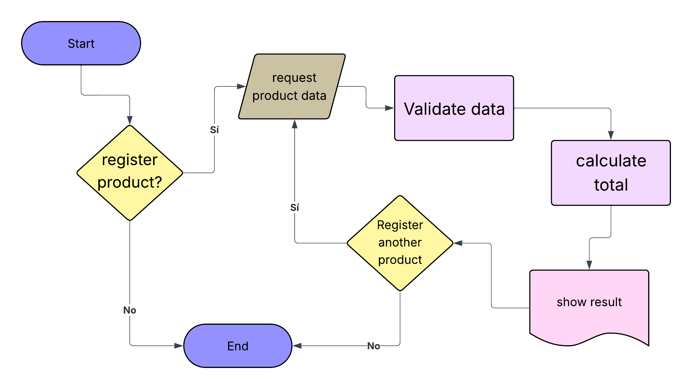

# 📦 Inventory-basics

## 📄 Project Description
A program that lets you register products in an inventory in a simple way. You enter the name, price, and quantity, and the system handles data validation, calculates the total cost, and displays the result on screen.

## ⚙️ How it works
1. Asks if you want to register a product
2. Requests the name, price, and quantity, validating that numeric data is correct
3. Calculates the total cost by multiplying price by quantity
4. Displays the result on screen with the name, price, quantity, and total
5. Asks if you want to register another product — if the answer is "no", the program ends

---

## 🛠️ Technologies used
- Python 3

---

## ▶️ How to run the code
1. Make sure you have Python installed
2. Download the `Inventory.py` file
3. Open the terminal and run:
```
python Inventory.py
```

---

## 🔀 Flowchart





---

## ✍️ Author
Breyner — 2026
